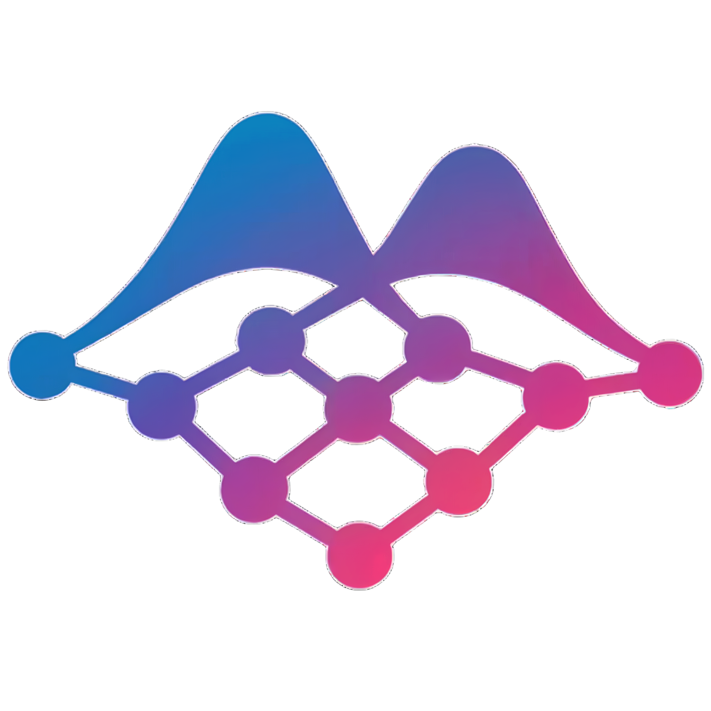

<p align="center">
  
</p>

<h1 align="center">SynthStats</h1>

<p align="center">
  
  
</p>

---

## Overview

SynthStats is research code exploring GFlowNet objectives for training language-model policies to generate probabilistic programs (PyMC). It scores proposed programs with task-specific rewards (often likelihood-based) and aims to maintain a diverse set of high-reward candidates rather than optimizing a single best output. The repository includes training loops (TB/SubTB), replay buffers, and benchmark tasks adapted from BoxingGym.

## Status

**Experimental research code.** Interfaces, defaults, and APIs may change. Not intended for production.

## What's Included

- **Training:** GFlowNet objectives (Sub-Trajectory Balance, Trajectory Balance) and prioritized replay buffers
- **Execution:** Protocol-based environment for PyMC programs with AST-based sandboxing
- **Benchmarks:** Tasks adapted from BoxingGym (Dugongs, Peregrines, Eight Schools, Surgical)
- **Architecture:** Plugin system separating Task, Policy, Executor, and Judge

## Sandboxing Note

Generated code is executed with best-effort constraints (AST checks, subprocess isolation). This is **not** a hardened security sandbox. Do not run on untrusted inputs.

## Experimental: SkyRL Compatibility

This repo includes experimental SkyRL-compatible trainer configs and loss registration, but does **not** use SkyRL's `BasePPOExp` training stack. Multi-node/SLURM execution depends on your cluster configuration.

## Installation

Requires Python 3.12 or 3.13:

```bash
git clone https://github.com/youqad/synthstats.git
cd synthstats

# Install dependencies
uv sync

# With ML + PyMC extras
uv sync --extra ml --extra pymc
```

## Quick Start

Train on Dugongs:

```bash
uv run python scripts/train_skyrl.py env=dugongs model=qwen3_0.6b
```

Override config via Hydra:

```bash
uv run python scripts/train_skyrl.py env=peregrines model=qwen3_4b \
  +trainer.batch_size=8 +wandb.project=my_experiment
```

Run tests:

```bash
uv run pytest
```

## Project Structure

```
src/synthstats/
├── core/           # Protocol definitions (Task, Policy, Executor, Judge)
├── training/       # GFlowNet losses (SubTB, TB), trainers, replay buffers
├── tasks/          # Task plugins (Boxing, etc.)
├── judges/         # Reward components (ELPD-LOO, formatting)
├── policies/       # Policy implementations (HuggingFace, mock)
├── executors/      # Execution sandboxes (PyMC)
└── integrations/   # Tinker API adapter
```

## Links

- **Documentation**: [docs/](docs/)
- **Issues**: [GitHub Issues](https://github.com/youqad/synthstats/issues)
